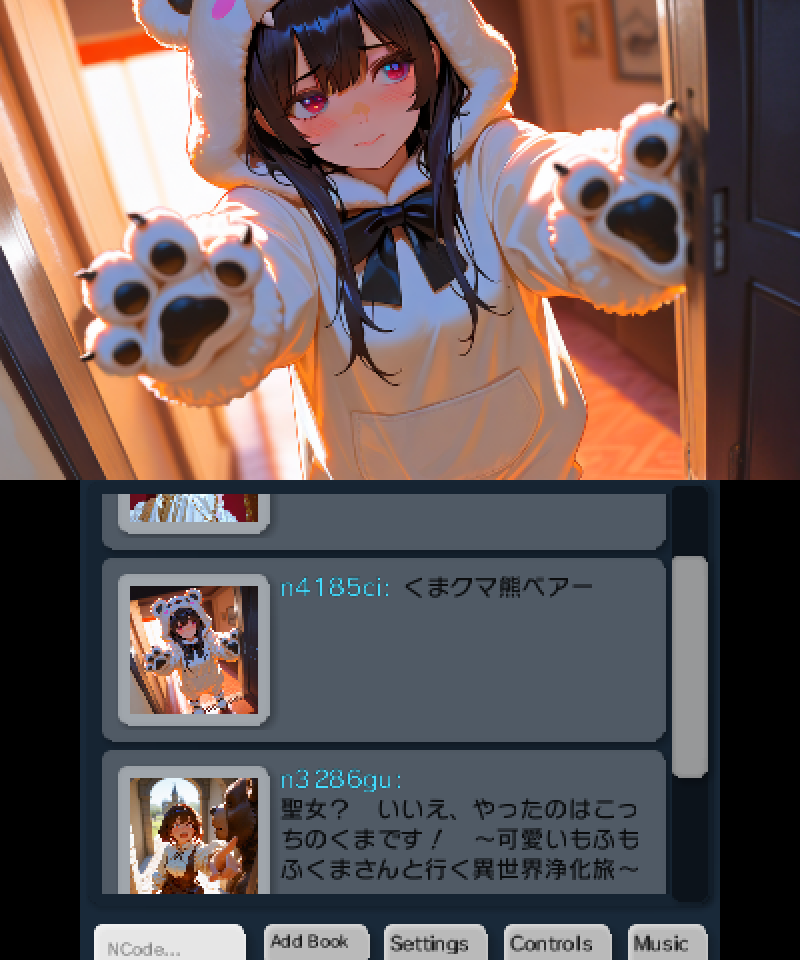
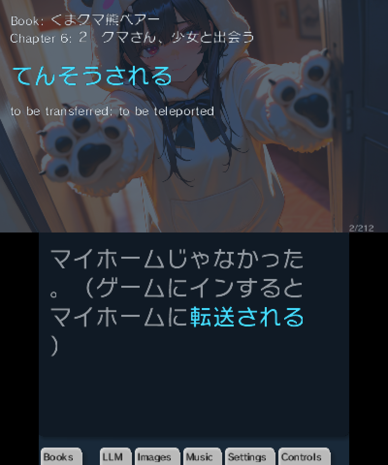
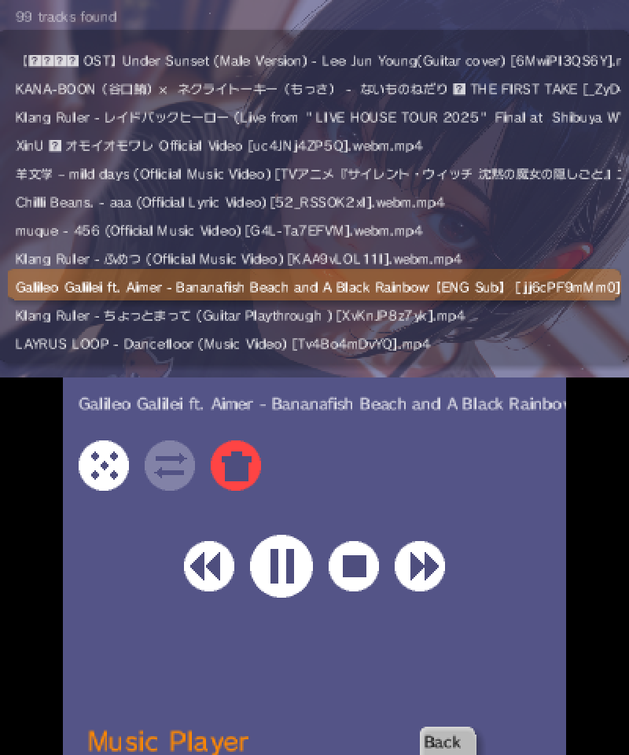
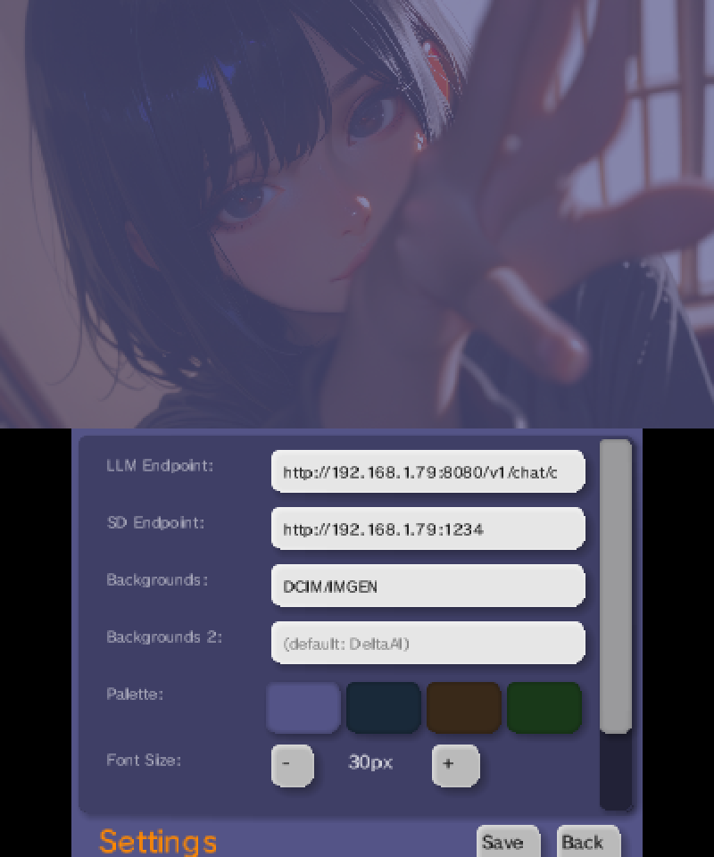
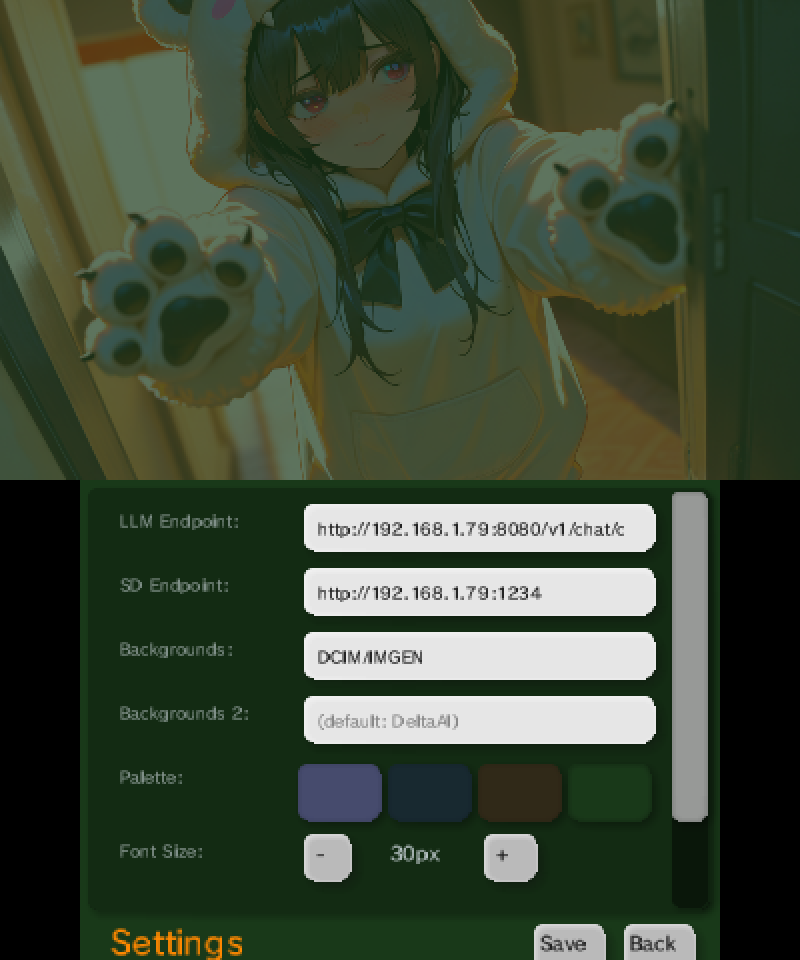

# Dokusho (読書)

**NovelReader for Nintendo 3DS** -- read, translate, and illustrate Japanese light novels on your 3DS.

**Beta release.** [Download latest](https://github.com/felipemanga/Dokusho/releases/latest)

## Features

- **Light novel reader** -- browse and read novels from Shōseta (小説家、なろう / Syosetu) by n-code
- **LLM-powered translation** -- line-by-line or chapter-level translation via a local LLM server (Ollama-compatible API)
- **AI-generated illustrations** -- automatic cover art and chapter backgrounds via Stable Diffusion
- **Music playback** -- attach MP3 soundtracks to your reading sessions
- **Customizable UI** -- multiple color palettes, adjustable font sizes, theme support

## Screenshots

| Novel List | Reader |
|---|---|
|  |  |

| Music Player | Settings |
|---|---|
|  |  |

| Color Customization |
|---|
|  |

## Requirements

- Nintendo 3DS (only tested on New 3DS XL)
- Optional: Local LLM server with OpenAI-compatible API (e.g., Ollama, llama.cpp)
- Optional: Stable-Diffusion.cpp server for book/chapter image generation
- SD card (stores all data in `Novels/`)

## Project Structure

```
data/
  settings.json              # Default configuration
  apps/
    NovelReader/             # Main reader application
      index.js               # App entry point
      Model.js               # Novel data, translation, metadata
      View.js                # Main view controller
      BooksView.js           # Book list & search
      ReaderView.js          # Reading interface
      SettingsView.js        # In-app settings
      ImageGenView.js        # Image generation UI
      MusicView.js           # Music player
      Keyboard.js            # On-screen keyboard
      LlmView.js             # Translation controls
      ControlsView.js        # Control bindings
      Shared.js              # Shared state, palettes, fonts
    ImageGen.js              # Standalone image gen app
  utils/
    3dsx.js                  # 3DSX format encoder/decoder
    EventBus.js / EventDispatcher.js  # Event system
    ImageGen.js              # Image processing utilities
    Markdown.js              # Markdown renderer
    StateMachine.js          # State machine utility
    StableDiffusion.js       # SD client
    llama.js                 # LLM client (OpenAI-compatible)
    strhash.js               # String hashing
    gui/                     # Custom GUI framework
      GUI.js                 # Core GUI engine
      Ctrl.js                # Base control class
      Button.js, Label.js, TextInput.js, Menu.js  # Controls
      Group.js               # Layout container
      RichText.js            # Rich text rendering
      Themes.js              # Theme/palette system
      FontCache.js, ImageCache.js, FrameCache.js, SoundCache.js  # Caching
      Root.js                # Root node
      coordExpression.js     # Coordinate expression parser
```

## Status

**Beta release.** Debug logging is enabled by default -- console output is useful for troubleshooting translation and image generation issues.

## License

MIT -- see [LICENSE](LICENSE)
